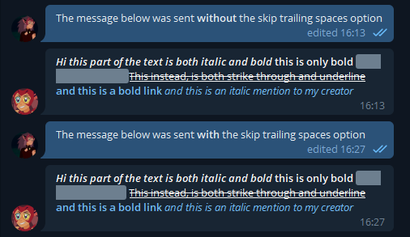
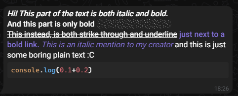

# Styling text
Telegram supports a lot of text decorations (Bold, Italic, Strikethrough, Underline, Spoiler, Url and Mention) but it may be hard to work with them. This is why CatraProto provides the `TextFormatter` class to help you create beautiful text easily.

## Getting a formatter
You can get an instance of `TextFormatter` by calling `GetTextFormatter` from the  `TelegramClient` class. You can also specify some options, which are described [here](#options).

## Formatting your text
The following methods are exposed by this class:
- `TextFormatter AddPlain(string text)` used to add simple text with no style.
- `TextFormatter AddMarkup(string text, MarkupType type)` used to add markup styles which don't require any additional parameters.
- `TextFormatter AddLink(string text, string link, MarkupType otherMarkup = MarkupType.None)` used to add a link hidden under a text which can also be decorated with other styles.
- `TextFormatter AddMention(string text, long userId, MarkupType otherMarkup = MarkupType.None)` used to add a mention to a user (not by username) hidden under a text which can also be decorated with other styles.
- `TextFormatter AddCode(string text, string language, MarkupType otherMarkup = MarkupType.None)` used to add language specific code highlighting.
- `(string Text, List<MessageEntityBase> Entities) GetFormatted()` used to get the final text and the entities used to decorate it.

You can combine multiple MarkupTypes using the bitwise OR (`|`) operator. See the [example](#usage-example) below to see how.
<div class="warning">
<p><b>Warning:</b> To mention a user <b>you must have seen them</b> at least once while using this session, otherwise the mention will not appear (other markup entities will still show up).</p>
</div>
<div class="note">
<p><b>Note:</b> As of now, the only official client supporting code-specific highlighting is Telegram WebZ.</p>
</div>
<div class="note">
<p><b>Note:</b> All the Add* methods return a reference to the exact same class they were called from. This is done to easily allow you to chain those calls.</p>
</div>

## Options
As of now, only the `SkipTrailingSpaces` option is allowed.\
It is used to avoid formatting trailing spaces in order to make the resulting string cleaner and it is enabled by default.
Here's an example of the same string with the option enabled and disabled:


If you want to disable it, you can specify `None` in the `GetTextFormatter` method.
```cs
_client.GetTextFormatter(MarkupOptions.None);
```

## Usage example 
```cs
var (text, entities) = _client.GetTextFormatter()
    .AddMarkup("Hi! This part of the text is both italic and bold.\n", MarkupType.Italic | MarkupType.Bold)
    .AddMarkup("And this part is only bold ", MarkupType.Bold)
    .AddMarkup("while this is a spoiler!\n", MarkupType.Spoiler)
    .AddMarkup("This instead, is both strike through and underline ", MarkupType.Strikethrough | MarkupType.Underline)
    .AddLink("just next to a bold link. ", "https://catraproto.github.io/docs", MarkupType.Bold)
    .AddMention("This is an italic mention to my creator ", YOUR_ID_GOES_HERE, MarkupType.Italic)
    .AddPlain("and this is just some boring plain text :C")
    .AddCode("console.log(0.1+0.2)", "js")
    .GetFormatted();

await _client.Api.CloudChatsApi.Messages.SendMessageAsync(PeerId.FromPeer(message.Peer), text, entities: entities);
```
This is what the end result looks like:

